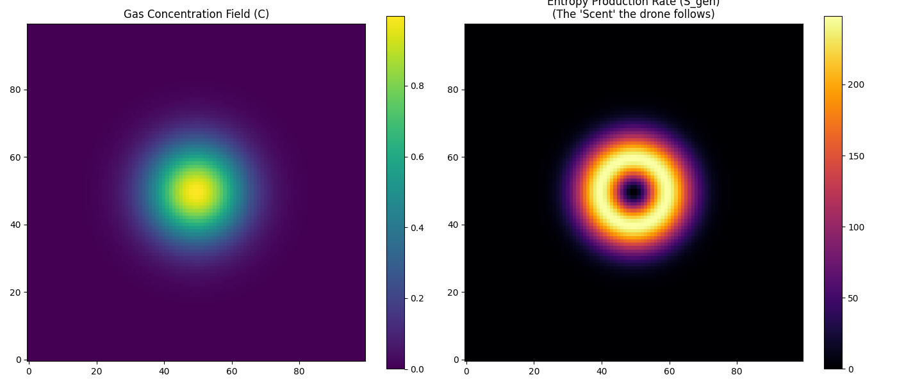
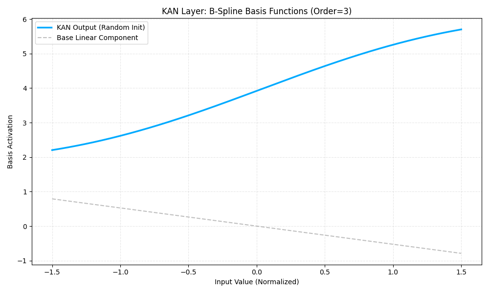

# ENTRODYN-AERIAL: Entropy-Gradient Navigation Swarm

**Status:** Simulation Active (Hardware-in-Loop Pending)
**Build:** v0.2.0-beta
**Documentation:** [Business Strategy & "Safety-as-a-Service" Model](docs/business_strategy.md)

## What is this?

This project forces a drone swarm to follow the **Second Law of Thermodynamics** to find gas leaks.

Standard sensors are too slow (20+ mins detection time). We wrote a custom **Kolmogorov-Arnold Network (KAN)** that calculates the _entropy production rate_ of the air. The drone follows the path of maximum disorder to find the leak source.

## Hardware Stack

- **Compute:** Laptop (RTX 4050) acting as Edge Station.
- **Drones:** Hexacopters with Pixhawk 4.
- **Sensors:** Thermal + MQ-135.

### Mathematical Core & Visualization

|   **Entropy Gradient Field (The "Scent")**   |    **KAN Spline Basis (The "Brain")**     |
| :------------------------------------------: | :---------------------------------------: |
|  |  |
|    _Drone tracks max entropy production_     |   _Learnable B-Splines replace weights_   |

## Why Custom KAN?

Standard MLPs were too heavy for real-time physics solving. We switched to KANs (Splines).
